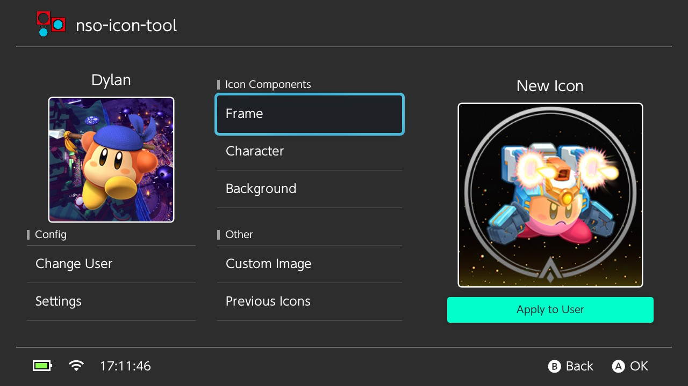
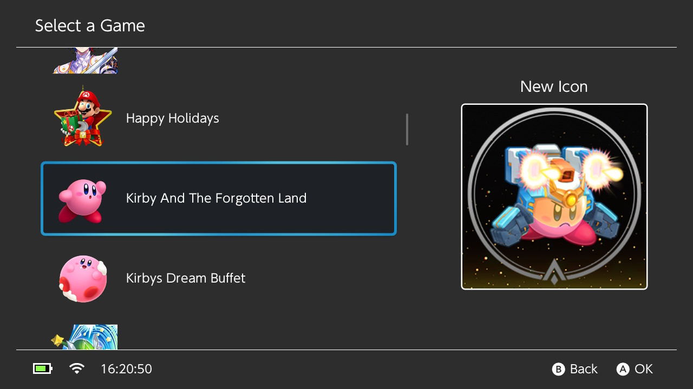
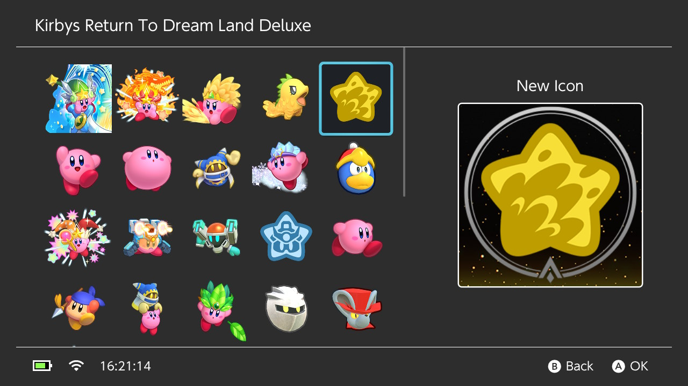
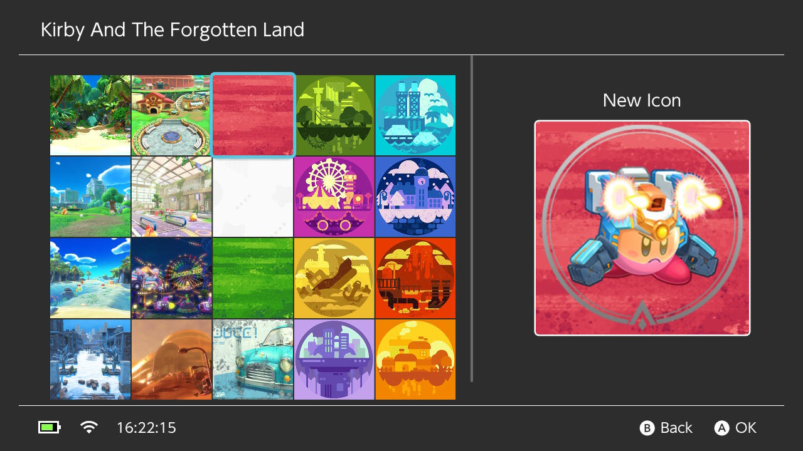
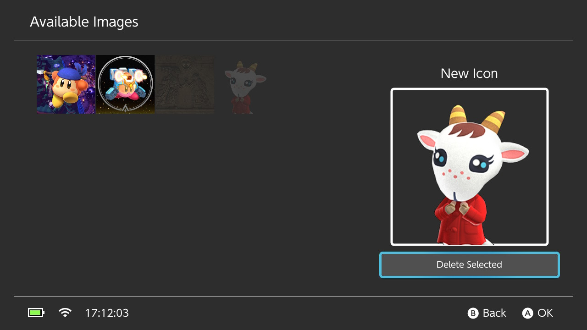
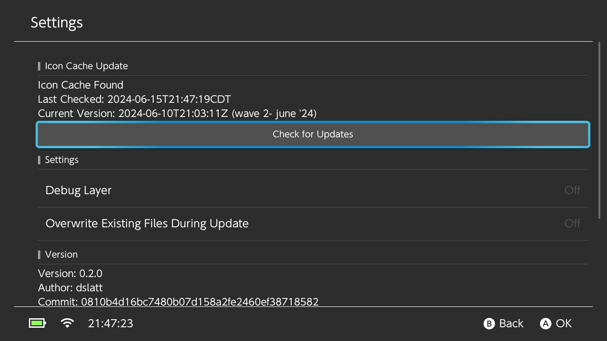

<div align="center">
    <h1>nso-icon-tool</h1>
    <p>A switch homebrew which allows you to create user icons like NSO</p>
</div>

<p align="center">
    <a rel="LICENSE" href="https://github.com/dslatt/nso-icon-tool/blob/master/LICENSE">
        
    </a>
    <a rel="VERSION" href="https://github.com/dslatt/nso-icon-tool">
        
    </a>
    <a rel="BUILD" href="https://github.com/dslatt/nso-icon-tool/actions">
        
    </a>
</p>

---
  
     

- [Features](#features)
- [Screenshot](#screenshot)
- [How to use](#how-to-use)
- [How to build](#how-to-build)
- [Help me](#help-me)
- [Credits](#credits)

## Features

- Create and apply custom user icons using available NSO Icon Elements
- Alternatively, use your own custom images as a user icon

## Screenshot



<details>
  <summary><b>More Screenshots</b></summary>








</details>

## How to use

### NSO Icons

> [!IMPORTANT]
> You must download the NSO Icon Cache from the settings page before they will be available. They aren't shipped with the application.

- NSO Icon components are (usually) split into 3 parts: a frame, a character, and a background. Use the related button from the main page to browse the available icon parts (e.g. `Frame` lets your browse available frames).
-  Once you've created the icon, use `Apply to User` and it will be automatically applied to the selected user. This change won't be immediately visible everywhere on the switch; just how it works.


#### NSO Icon Cache

- The icon cache contains all the NSO icon components. It must be downloaded in settings before they are available. This can take awhile the first time so be patient.
- You can check for updates to the icon cache from settings. If new icons are available, you can downloaded the new cache and update your local copy if desired.
- The cache is kept in `sdmc:/avatars/nso-icons-main`.
- For speed, existing files aren't overwritten when updating the cache. If you have an issue, you can use `Overwrite Existing Files During Update` in settings to toggle this behavior.
- Icon cache location: [https://github.com/henry-debruin/nso-icons](https://github.com/henry-debruin/nso-icons)


### Custom Images
- Place any custom images (PNG or JPG) into `sdmc:/avatars/` so they will be found. Sizing your images to 256x256 would be best, but incorrectly sized images will be resized automatically. This will likely not work well if the image width/height aren't equal.
- Select `Custom Images` on the main screen if you want to use the image as your avatar directly.
- You can also select `Custom Images` from one of the Icon Component lists (e.g. `Character`, `Frame`, or `Background`) if you want to use your image together with parts from the NSO Icon Cache to build your avatar.

## How to build

### Requirements

- [devkitPro](https://devkitpro.org/wiki/Getting_Started)
- [CMake](https://cmake.org/)

### Docker
- `compose.yaml` is provided which can be used with Docker as a build environment already containing the necessary requirements

### Build

```bash
git clone --recursive https://github.com/dslatt/nso-icon-tool/
cd nso-icon-tool
cmake -B build_switch -DPLATFORM_SWITCH=ON
make -C build_switch nso-icon-tool.nro -j$(nproc)
```
 or
```bash
git clone --recursive https://github.com/dslatt/nso-icon-tool/
cd nso-icon-tool
./proj_build.sh
 ```

#### Using MSYS2
You need a working DevKitPro installation and then install the packages:

#### MingW64:
```bash
pacman -Syuu git make cmake mingw-w64-x86_64-gcc switch-cmake libnx switch-dev switch-glfw switch-curl switch-libzstd switch-liblzma switch-lz4 switch-bzip2 switch-xxhash
```
#### MSYS
```bash
pacman -Syuu git make cmake gcc switch-cmake libnx switch-dev switch-glfw switch-curl switch-libzstd switch-liblzma switch-lz4 switch-bzip2 switch-xxhash
```

The commands to build are:
```bash
cd ~
rm -rf ~/nso-icon-tool
git clone --recursive https://github.com/dslatt/nso-icon-tool
cd ~/nso-icon-tool
./proj_build.sh

```

## Help me

If you want to help me open an issue when you encounter a bug and a pull request if you have a fix. Thanks!

## Special Thanks

- Special thanks to [henry-debruin](https://github.com/henry-debruin) and [simon-debruin](https://github.com/simon-debruin) for creating [nso-icons](https://github.com/henry-debruin/nso-icons). There's no way this would have been made without your work pulling all the icons together that way!
- Thanks to [delta](https://github.com/MCMi460) for creating [nso-applet-api](https://github.com/MCMi460/nso-applet-api) which is used to create the icon dump
- Also, thanks to [mydough](https://gbatemp.net/members/mydough.571103/) for helping me find the right people to credit for the icon cache

## Credits

- Thanks to [Natinusala](https://github.com/natinusala), [xfangfang](https://github.com/xfangfang) and [XITRIX](https://github.com/XITRIX) for [borealis](https://github.com/xfangfang/borealis)
- Thanks to [XorTroll](https://github.com/XoRTroll) for [Golfleaf](https://github.com/XorTroll/Goldleaf), [HamletDuFromage ](https://github.com/HamletDuFromage ) for [AIO-Switch-Updater](https://github.com/HamletDuFromage/aio-switch-updater),[PoloNX](https://github.com/PoloNX) for [SimpleModDownloader](https://github.com/PoloNX/SimpleModDownloader), and [nadrino](https://github.com/nadrino) for [SimpleModManager](https://github.com/nadrino/SimpleModManager). These are all good examples of switch homebrew development.
- Thanks to anyone who helped translate!
